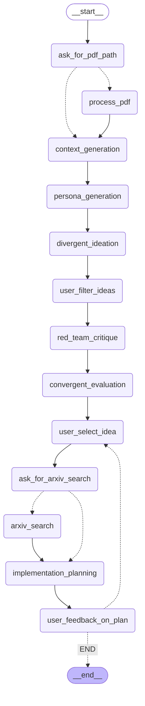

# Multi-Agent Brainstorming System

**[中文版 / Chinese Version](./README-zh.md)**

**Try it now:** [https://lum1104.github.io/agent-brainstorm/](https://lum1104.github.io/agent-brainstorm/)

**Example of Brainstorm:** [Idea inspired by Emotion-LLaMA](./example.md)

A Python-based AI agent system that utilizes Google's Gemini API to facilitate structured brainstorming sessions through multiple AI personas. The system runs as a command-line application with an interactive workflow.

## Overview

This system implements a 5-stage brainstorming methodology using AI agents to generate, evaluate, and refine ideas for both project development and research papers. The entire process runs locally with real-time web search integration and ArXiv research capabilities.



## Getting Started

### Installation
```bash
git clone https://github.com/Lum1104/agent-brainstorm.git
cd agent-brainstorm

conda create -n brainstorm python=3.12
conda activate brainstorm

pip install -r requirements.txt
python main.py
```

### API Key Setup
1. Visit [Google AI Studio](https://aistudio.google.com/apikey)
2. Create a free account if needed
3. Generate an API key (for FREE)
4. Set the API key as an environment variable:
   ```bash
   export GOOGLE_API_KEY="your-api-key-here"
   ```
   Or the application will prompt you to enter it when running.

## Project Structure
```
agent-brainstorm/
├── main.py                     # Main entry point
├── brainstorm_tool/
│   ├── agents/
│   │   ├── workflow.py         # Core brainstorming workflow
│   │   ├── schemas.py          # Data validation schemas
│   │   └── prompts.py          # Agent prompt templates
│   └── utils/
│       ├── ui.py               # User interface utilities
│       └── file_utils.py       # File processing utilities
├── requirements.txt            # Python dependencies
└── README.md
```

## Features

### 🤖 Multi-Agent Architecture
- **Preview Agent**: Assembles expert teams with distinct personas
- **RAG Agent**: Provides contextual research and background information using web search and ArXiv
- **Ideation Agents**: Generate diverse ideas from different perspectives
- **Critic Agent**: Evaluates and ranks generated ideas with red team critique
- **Expert Agent**: Creates detailed implementation plans

### 📋 Two Brainstorming Modes
1. **Project Ideas**: For products, features, and development projects
2. **Research Papers**: For academic topics, studies, and research questions

### 🔄 6-Stage Workflow
1. **Context Generation**: Gather relevant background information via web search
2. **Define Direction & Assemble Team**: Configure personas based on your topic
3. **Divergent Ideation**: Generate multiple ideas from different perspectives
4. **Red Team Critique**: Challenge ideas with devil's advocate analysis
5. **Convergent Evaluation**: Analyze, cluster, and rank ideas
6. **Final Document Generation**: Create detailed plans for selected ideas


## How to Use

### Step-by-Step Process

#### Step 1: Configuration
- Select your brainstorming type (Project or Research Paper)
- Enter your topic (e.g., "Using LLM for the course project of HCI")
- Optionally provide a PDF file for additional context

#### Step 2: Context Generation
The system automatically searches the web for relevant information about your topic.

#### Step 3: Expert Team Assembly
The Preview Agent assembles a team of 4 expert personas relevant to your topic, each with:
- **Role**: Their area of expertise
- **Goal**: What they aim to achieve
- **Backstory**: Their professional background

#### Step 4: Divergent Ideation
Each expert persona generates 5 unique ideas. You can:
- Review all generated ideas
- Filter out ideas you want to exclude
- Select the most promising concepts

#### Step 5: Red Team Critique
A devil's advocate agent challenges each idea with critical analysis.

#### Step 6: Convergent Evaluation
The Critic Agent:
- Analyzes and clusters similar ideas
- Evaluates each concept on multiple criteria
- Provides detailed justifications incorporating red team feedback
- Ranks the top 3 recommendations

#### Step 7: Implementation Planning
Select one of the top ideas to generate:
- **For Projects**: Implementation plan with requirements, tech stack, timeline, and resources
- **For Research**: Research outline with methodology, literature review, and publication targets

### Output
The system generates a comprehensive Markdown report containing:
- Complete session transcript
- All generated ideas and critiques
- Final evaluation and ranking
- Detailed implementation plan
- Relevant academic references from ArXiv

## Example Use Cases

### Project Development
- "Mobile app for university students"
- "AI-powered learning platform"
- "Sustainable energy management system"

### Research Papers
- "Machine learning in healthcare"
- "Human-computer interaction studies"
- "Climate change mitigation strategies"
