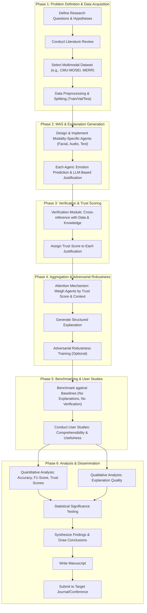

# Brainstorm Session: improving emotion-llama with multi-llm collabroation

**Type:** Research Paper

## Stage 1: Context & Team

### Research Context

**Web Search Summary:**
This text provides an overview of four distinct but related concepts: Emotion AI, Large Language Models (LLMs), Collaboration, and Multi-Agent Systems (MAS). Emotion AI, also known as affective computing, is a field of AI focused on recognizing, interpreting, and responding to human emotions using data streams like facial expressions and voice patterns. LLMs are AI algorithms employing deep learning on massive datasets to understand and generate text, driving the generative AI boom. Collaboration, crucial in the workplace and digital projects, involves individuals or teams working together, requiring specific skills and utilizing various tools. MAS are computer systems where multiple independent agents cooperate or compete in a shared environment; current approaches often use orchestrators, but true distributed systems exhibit emergent coordination from agent interactions.

---

**Uploaded Document Context:**
The paper introduces Emotion-LLaMA, a multimodal large language model (MLLM) designed for improved emotion recognition and reasoning. It addresses limitations in existing MLLMs, specifically their inability to process audio and recognize subtle facial micro-expressions. To facilitate this, the authors created the MERR dataset, comprising 28,618 coarse-grained and 4,487 fine-grained annotated samples covering diverse emotional categories. Emotion-LLaMA integrates audio, visual, and textual inputs through emotion-specific encoders, aligning features into a shared space and employing instruction tuning on a modified LLaMA model. Experimental results demonstrate that Emotion-LLaMA outperforms other MLLMs on several benchmarks, including EMER, MER2023, and DFEW, achieving state-of-the-art performance in multimodal emotion analysis. The work highlights the importance of specialized multimodal emotion instruction datasets and emotion-specific encoders for enhancing emotional recognition and reasoning capabilities in MLLMs.

### Assembled Agent Team

- **Affective Computing Specialist**

  - **Goal:** Explore novel architectures for multi-LLM collaboration that improve Emotion-LLaMA's emotion recognition accuracy, particularly for nuanced expressions and cross-modal discrepancies.

  - **Backstory:** Years of experience designing emotion recognition systems using traditional machine learning. Frustrated by the limitations of single-modal approaches and excited by the potential of LLMs, but cautious about their biases and lack of explainability in affective contexts.

- **Multi-Agent Systems Architect**

  - **Goal:** Design a distributed multi-agent system where multiple LLMs specialize in different aspects of emotion recognition (e.g., facial expression analysis, audio tone detection, contextual understanding) and collaborate to provide a more holistic and accurate assessment.

  - **Backstory:** Extensive experience building complex MAS for various applications, including robotics and distributed sensing. Interested in applying MAS principles to improve the robustness and adaptability of emotion recognition systems, moving beyond centralized orchestrators.

- **LLM Fine-tuning Expert**

  - **Goal:** Develop fine-tuning strategies for multiple LLMs that enable them to effectively collaborate and enhance Emotion-LLaMA's ability to generalize to new emotional expressions and diverse datasets, while mitigating potential conflicts or biases arising from the collaboration.

  - **Backstory:** Deep understanding of LLM architectures and fine-tuning techniques. Concerned about the data and computational costs associated with training large collaborative models and focused on developing efficient and scalable fine-tuning methods.

- **Ethical AI Researcher**

  - **Goal:** Identify and mitigate potential ethical concerns related to using multi-LLM collaboration for emotion recognition, such as bias amplification, privacy violations, and the potential for misuse in manipulative or discriminatory applications.

  - **Backstory:** Dedicated to promoting responsible AI development and deployment. Expertise in fairness, accountability, and transparency in AI systems. Passionate about ensuring that emotion recognition technologies are used ethically and benefit society as a whole.

## Stage 2: Divergent Ideation

### All Generated Ideas (Pre-Filtering)

#### Idea 1

- **Research Question:** How can we design a 'contrastive learning' framework for multi-LLM collaboration to explicitly address cross-modal discrepancies and inconsistencies in emotion cues, leading to more robust and accurate emotion recognition?

- **Methodology:** Implement a contrastive learning objective that encourages the LLMs to agree on the predicted emotion, even when presented with conflicting cues from different modalities (e.g., a smiling face with a sad voice). Train the expert LLMs and Emotion-LLaMA jointly, penalizing disagreements and rewarding consistent predictions. Use adversarial examples to further stress-test and improve the robustness of the system to cross-modal discrepancies.

- **Contribution:** A novel training paradigm for multi-LLM emotion recognition that explicitly addresses the challenges of cross-modal inconsistency, leading to improved robustness and accuracy.

- **Rationale:** **Affective Computing Specialist**: The ability to reconcile conflicting cues is crucial for real-world emotion recognition, and contrastive learning offers a principled way to train LLMs to handle these inconsistencies effectively.
**LLM Fine-tuning Expert**: Contrastive learning offers a structured way to force alignment between LLMs operating on different modalities, leading to a more robust and generalizable emotion recognition system and better handling of real-world noisy data.

- **🔥 Red Team Critique:** The premise assumes that simply forcing LLMs to 'agree' on an emotion label, even with conflicting cues, necessarily leads to *accurate* recognition. This overlooks the possibility that the ground truth is ambiguous or nuanced, and forcing agreement might actually *reduce* the system's ability to represent uncertainty or acknowledge conflicting interpretations. The methodology also risks overfitting to specific types of adversarial examples used during training, leading to poor generalization to unseen real-world scenarios. Furthermore, the 'novelty' of applying contrastive learning in this specific multi-modal emotion recognition context needs to be clearly demonstrated against existing fusion techniques; otherwise, it's just a rehash of a well-established method.

#### Idea 2

- **Research Question:** How can knowledge distillation be employed to transfer emotion-specific knowledge from multiple specialized LLMs to Emotion-LLaMA, improving its emotion recognition capabilities without significantly increasing its model size?

- **Methodology:** Train several specialized LLMs on different aspects of emotion recognition (e.g., facial expressions, vocal tones, textual cues). Use knowledge distillation to transfer the learned knowledge from these models to Emotion-LLaMA, focusing on preserving emotion-related features and reasoning abilities.

- **Contribution:** An efficient knowledge transfer method that enhances Emotion-LLaMA's emotion recognition performance by leveraging the expertise of multiple specialized LLMs, while maintaining a manageable model size.

- **Rationale:** **Affective Computing Specialist**: Knowledge distillation is a practical approach to improve Emotion-LLaMA by leveraging the strengths of multiple specialized models without incurring the computational cost of a large ensemble.
**LLM Fine-tuning Expert**: Knowledge distillation is a powerful technique to compress the knowledge of multiple large models into a single, smaller model, addressing the computational burden of large collaborative models without sacrificing performance.

- **🔥 Red Team Critique:** The 'so what?' problem looms large here. Knowledge distillation is a common technique. The contribution hinges on *how* it's applied and whether it demonstrably outperforms simpler fine-tuning approaches. Simply showing an improvement over the base Emotion-LLaMA is insufficient; a comparison against other knowledge transfer methods or even a well-designed fine-tuning strategy is crucial. Additionally, the methodology needs to address the potential for negative transfer, where knowledge from one specialized LLM might interfere with or degrade the performance of Emotion-LLaMA on other emotion-related tasks. The assumption that all 'emotion-specific knowledge' is beneficial and transferable needs to be rigorously examined.

#### Idea 3

- **Research Question:** What are the potential biases embedded in the MERR dataset and how can multi-LLM collaboration be used to identify, quantify, and mitigate these biases, leading to a fairer and more equitable Emotion-LLaMA?

- **Methodology:** Employ multiple LLMs with expertise in bias detection to analyze the MERR dataset for biases related to demographics, cultural background, and emotional expression. Use data augmentation or re-weighting techniques to mitigate identified biases. Evaluate the fairness of the resulting Emotion-LLaMA model using appropriate fairness metrics.

- **Contribution:** A comprehensive analysis of biases in the MERR dataset and a multi-LLM-based approach to mitigate these biases, resulting in a fairer and more equitable Emotion-LLaMA model.

- **Rationale:** **Affective Computing Specialist**: Addressing biases in datasets is crucial for ensuring fairness and preventing discriminatory outcomes, and a multi-LLM approach may provide a more comprehensive and robust bias detection and mitigation strategy.
**LLM Fine-tuning Expert**: Addressing biases in emotion datasets is critical for building fair and equitable AI systems, and a collaborative approach using multiple LLMs can provide a more comprehensive and robust bias detection and mitigation strategy.
**Ethical AI Researcher**: Bias mitigation is crucial for ensuring fairness and preventing discriminatory outcomes, which are essential for building ethical and responsible emotion recognition systems.

- **🔥 Red Team Critique:** The proposal assumes that LLMs are inherently capable of identifying biases in a *reliable* and *unbiased* manner. LLMs themselves are trained on biased data, so using them for bias detection is potentially circular and could reinforce existing biases or introduce new ones. The methodology needs to explicitly address how the LLMs' own biases are accounted for and mitigated during the bias detection and mitigation process. Furthermore, the choice of 'fairness metrics' is crucial and should be justified; different metrics can lead to conflicting conclusions about the fairness of the resulting model. Simply applying data augmentation or re-weighting without careful consideration of the underlying causes of bias might not be effective and could even exacerbate existing disparities. Finally, bias detection is only part of the problem; remediation might require more than just data manipulation; it might require changes to the model architecture or training objective.

#### Idea 4

- **Research Question:** How can reinforcement learning (RL) be used to train a collaborative multi-LLM system to provide personalized and context-aware emotional support, while simultaneously optimizing for ethical considerations such as avoiding manipulative or harmful responses?

- **Methodology:** Develop an RL environment where multiple LLM agents collaborate to provide emotional support to users. Define a reward function that incentivizes helpful and empathetic responses while penalizing manipulative or harmful behaviors. Use human feedback to fine-tune the reward function and evaluate the ethical implications of the trained system.

- **Contribution:** A reinforcement learning framework for training a collaborative multi-LLM system to provide personalized emotional support while adhering to ethical guidelines, ensuring responsible use in sensitive applications such as mental health support.

- **Rationale:** **Affective Computing Specialist**: RL offers a promising approach for developing ethical and effective emotional support systems, but careful consideration must be given to defining appropriate reward functions and mitigating potential unintended consequences.
**Ethical AI Researcher**: This research explores the potential of RL for ethical emotional support, addressing the critical need to prevent manipulative or harmful applications while promoting beneficial use cases.

- **🔥 Red Team Critique:** This idea is fraught with ethical challenges. Defining a reward function that accurately captures 'helpful' and 'empathetic' responses while reliably penalizing 'manipulative' or 'harmful' behaviors is extremely difficult. Human feedback is subjective and can be inconsistent, leading to unintended biases in the learned behavior. The RL agent might learn to exploit loopholes in the reward function or discover unintended consequences that are difficult to foresee. Furthermore, even with careful reward shaping, there's a risk of the system generating overly generic or superficial responses that, while not explicitly harmful, lack genuine empathy and could be perceived as insincere or even patronizing. The reliance on human feedback introduces a scalability problem; gathering sufficient high-quality feedback for complex emotional support scenarios is resource-intensive and potentially emotionally taxing for the annotators. Finally, the potential for the system to be used for malicious purposes (e.g., manipulating vulnerable individuals) needs to be carefully considered and addressed.

#### Idea 5

- **Research Question:** What emergent communication protocols and coordination mechanisms arise within a MAS of emotion-recognizing LLMs when trained with reinforcement learning to optimize for collective accuracy and minimal communication overhead?

- **Methodology:** Implement a reinforcement learning environment where individual LLM agents receive rewards based on the overall system accuracy and penalties based on communication volume; explore different reward shaping strategies and analyze the resulting communication patterns and coordination behaviors.

- **Contribution:** Discover novel emergent communication strategies and coordination mechanisms that optimize the trade-off between accuracy and efficiency in a distributed emotion recognition system.

- **Rationale:** **Multi-Agent Systems Architect**: Investigating emergent behaviors in a MAS provides valuable insights into creating efficient and adaptive emotion recognition systems, especially when considering resource constraints like communication bandwidth or computational power.
**LLM Fine-tuning Expert**: Understanding emergent communication patterns in a MARL setting can reveal novel and efficient collaboration strategies that are not explicitly programmed, leading to more scalable and robust systems.

- **🔥 Red Team Critique:** The core assumption that 'emergent' communication protocols will necessarily be *useful* or *interpretable* is questionable. The RL agents might discover highly specialized and opaque communication strategies that are difficult to understand or generalize to other tasks. The methodology needs to include a rigorous analysis of the emergent communication patterns to determine their effectiveness and interpretability. Furthermore, the choice of reward shaping strategy can significantly influence the resulting communication protocols; different reward functions might lead to vastly different emergent behaviors. The proposal needs to justify the choice of reward function and address the potential for unintended consequences. Finally, the 'minimal communication overhead' objective needs to be carefully balanced against the potential for reduced accuracy; overly prioritizing communication efficiency might lead to suboptimal performance in emotion recognition.

#### Idea 6

- **Research Question:** How can the explainability of emotion recognition be improved by leveraging a MAS architecture, allowing each agent to provide a modality-specific justification for its contribution to the final emotion classification?

- **Methodology:** Design a MAS where each LLM agent (facial expression, audio, text) outputs not only its emotion prediction but also a confidence score and a textual justification; develop a method for aggregating these justifications into a comprehensive explanation for the overall system decision.

- **Contribution:** Enhance the transparency and trustworthiness of emotion recognition systems by providing modality-specific explanations for the final emotion classification.

- **Rationale:** **Multi-Agent Systems Architect**: A MAS provides a natural structure for enhancing explainability by allowing each agent to provide a modality-specific justification for its contribution, improving trust and transparency in the system's decision-making process.
**Ethical AI Researcher**: A MAS architecture offers a structured approach to generating modality-specific explanations, enhancing transparency and facilitating accountability in emotion recognition systems.

- **🔥 Red Team Critique:** The assumption that modality-specific 'justifications' provided by individual LLM agents are inherently *truthful* or *reliable* is a major weakness. LLMs are known to generate plausible-sounding but factually incorrect explanations. The methodology needs to include a mechanism for verifying the accuracy and coherence of the justifications provided by each agent. Furthermore, simply aggregating individual justifications does not guarantee a *comprehensive* or *understandable* explanation for the overall system decision. The aggregation method needs to be carefully designed to ensure that the resulting explanation is coherent, concise, and informative. The 'confidence score' is also potentially misleading; a high confidence score does not necessarily indicate a correct or reliable justification. Finally, the proposal needs to address the potential for adversarial attacks, where malicious actors could manipulate the input modalities to generate misleading explanations.

#### Idea 7

- **Research Question:** What are the effects of different orchestration strategies for coordinating Emotion-LLaMA and other LLMs in a multi-agent system, and how do these strategies impact the overall system's performance and robustness?

- **Methodology:** Implement various orchestration strategies, such as a centralized orchestrator, a decentralized consensus mechanism, and a hierarchical control structure. Evaluate the performance of each strategy in terms of emotion recognition accuracy, response time, and resilience to agent failures.

- **Contribution:** A comprehensive analysis of different orchestration strategies for LLM collaboration, providing insights into the trade-offs between performance, robustness, and complexity in multi-agent emotion AI systems.

- **Rationale:** **Multi-Agent Systems Architect**: Exploring different orchestration strategies is essential for designing effective multi-agent systems for emotion AI, as it directly impacts how LLMs interact, collaborate, and contribute to the overall system behavior and resilience.
**LLM Fine-tuning Expert**: The choice of orchestration strategy significantly impacts the efficiency, scalability, and fault tolerance of multi-LLM systems, requiring a systematic evaluation to identify the optimal approach for different application scenarios.

- **🔥 Red Team Critique:** The idea lacks a clear articulation of the *criteria* for evaluating 'performance' and 'robustness.' Emotion recognition accuracy is an obvious metric, but response time and resilience to agent failures need to be more precisely defined and operationalized. For example, what constitutes an 'acceptable' response time, and how is 'agent failure' defined? Furthermore, the choice of orchestration strategies (centralized, decentralized, hierarchical) seems somewhat arbitrary. The proposal needs to justify the selection of these specific strategies and explain why they are relevant to the problem of multi-LLM emotion recognition. The 'so what?' question arises again: will the analysis provide actionable insights that can inform the design of future multi-agent emotion AI systems, or will it simply be a descriptive comparison of different orchestration approaches? Finally, the proposal needs to consider the scalability of the different orchestration strategies to larger numbers of LLM agents.

## Stage 3: Convergent Evaluation

| Research Avenue | Description | Novelty (1-10) | Methodology (1-10) | Contribution (1-10) | Justification (incorporating red team feedback) |
|---|---|---|---|---|---|
| **Contrastive Learning for Multi-Modal Emotion Recognition** | Develop a contrastive learning framework to train multiple LLMs to agree on emotion predictions, even with conflicting cross-modal cues. | 6 | 7 | 6 |  While contrastive learning is not new, applying it to reconcile *specific* cross-modal inconsistencies in emotion recognition, with careful consideration of ambiguous ground truth and overfitting, could be valuable. Need to compare against established fusion methods. |
| **Knowledge Distillation for Emotion-Specific Knowledge Transfer** | Use knowledge distillation to transfer emotion-specific knowledge from specialized LLMs to Emotion-LLaMA to improve performance without increasing model size. | 5 | 7 | 5 | Knowledge distillation itself is not novel, but the *specific* application of transferring *carefully selected* emotion-related features and reasoning abilities, with a robust comparison against simpler fine-tuning methods and addressing potential negative transfer, could be impactful. |
| **Bias Detection and Mitigation in the MERR Dataset using Multi-LLM Collaboration** | Analyze the MERR dataset for biases using multiple LLMs and implement mitigation techniques to create a fairer Emotion-LLaMA. | 7 | 6 | 7 |  Addresses a crucial ethical concern. Requires careful consideration of the LLMs' own biases, a justification for the chosen fairness metrics, and a more holistic approach to remediation beyond data manipulation. |
| **Reinforcement Learning for Ethical Emotional Support** | Train a collaborative multi-LLM system using reinforcement learning to provide personalized emotional support while optimizing for ethical considerations. | 6 | 5 | 6 |  High ethical risk. Requires a rigorously defined and validated reward function, careful monitoring for unintended consequences, and a robust strategy for preventing malicious use. Scalability of human feedback is a major concern. |
| **Emergent Communication Protocols in Multi-Agent Emotion Recognition** | Explore emergent communication protocols and coordination mechanisms in a multi-agent system of emotion-recognizing LLMs trained with reinforcement learning. | 7 | 7 | 6 | Focuses on emergent behaviors. Requires a rigorous analysis of the effectiveness and interpretability of the emergent communication patterns. Justify the choice of reward function and balance communication efficiency with accuracy. |
| **Explainable Emotion Recognition via Modality-Specific Justifications in a MAS** | Improve the explainability of emotion recognition by leveraging a MAS architecture where each agent provides a modality-specific justification. | 7 | 6 | 7 | Focuses on explainability. Requires a mechanism for verifying the accuracy and coherence of the justifications provided by each agent and a method for creating comprehensive and understandable explanations. Address the potential for adversarial attacks. |
| **Orchestration Strategies for Multi-LLM Emotion AI Systems** | Analyze the effects of different orchestration strategies for coordinating Emotion-LLaMA and other LLMs in a multi-agent system. | 6 | 7 | 6 | Requires precise definitions of 'performance' and 'robustness' and a justification for the selection of specific orchestration strategies. Needs to demonstrate actionable insights and consider scalability. |

Here are the top ideas:

## Stage 4: Final Plan

### 1. Inferred Research Field & Problem Statement
* **Title:** Explainable Emotion Recognition via Modality-Specific Justifications in a MAS
* **Inferred Field:** Computer Science - Artificial Intelligence (AI), specifically Explainable AI (XAI) and Multi-Agent Systems (MAS). This also overlaps with Affective Computing and Natural Language Processing (NLP).
* **Problem Context:** Emotion recognition is increasingly deployed in various applications, but often lacks transparency. Users need to understand *why* a system made a certain emotion prediction, not just the prediction itself. Explainable AI (XAI) aims to address this "black box" problem, enhancing trust and enabling error correction.
* **Core Challenge & Objectives:** The core challenge is to develop an emotion recognition system that provides reliable, modality-specific explanations for its predictions, even in the face of potentially misleading input.

    *   **Objective 1:** Design and implement a Multi-Agent System (MAS) where each modality-specific agent (e.g., facial expression, audio, text) generates both an emotion prediction and a textual justification.
    *   **Objective 2:** Develop a verification mechanism using external knowledge and data consistency checks to assign a 'trust score' to each justification, mitigating the risk of unreliable LLM-generated explanations.
    *   **Objective 3:** Evaluate the comprehensibility and usefulness of the generated explanations through user studies.

### 2. Detailed Proposed Methodology
* **Research Design:** Algorithm Development & Benchmarking. This involves designing a novel algorithm (the MAS with justification and verification) and then systematically evaluating its performance against baseline approaches.
* **Data & Procedures:**
    *   **Data Requirements:** A multimodal dataset with labeled emotions and corresponding facial expressions, audio recordings, and textual data. Examples include:
        *   Existing multimodal emotion recognition datasets (e.g., CMU-MOSEI, IEMOCAP, MERR from the uploaded document).
        *   Potentially augmented datasets with adversarial examples designed to mislead individual modalities.
    *   **Execution Steps:**
        1.  **Data Preparation:** Preprocess the chosen multimodal dataset (e.g., feature extraction from audio, facial expression analysis, text cleaning and embedding). Split the data into training, validation, and testing sets.
        2.  **Agent Design & Implementation:** Develop modality-specific agents (facial expression, audio, text) within the MAS. Each agent will:
            *   Predict an emotion based on its input modality.
            *   Generate a textual justification using an LLM (e.g., fine-tuned Emotion-LLaMA or similar).
        3.  **Verification Mechanism:** Implement a verification module that:
            *   Cross-references the agent's justification with the input data (e.g., does the justification align with the observed facial action units?).
            *   Consults external knowledge sources (e.g., emotion lexicons, common-sense reasoning databases).
            *   Assigns a trust score to the justification based on its consistency and coherence.
        4.  **Aggregation & Explanation Generation:** Develop an attention mechanism that weighs the agents' predictions and justifications based on their trust scores and the overall context. Generate a structured explanation that highlights the key contributing factors and their associated confidence levels.
        5.  **Adversarial Robustness Training:** Train the system to detect and mitigate adversarial attacks. This could involve training a detector that identifies manipulated input modalities or using adversarial training techniques to make the agents more robust.
        6.  **Benchmarking:** Compare the performance of the proposed MAS with justification and verification against baseline approaches (e.g., a standard multimodal emotion recognition model without explanations, a MAS without the verification mechanism).
        7.  **User Study:** Conduct user studies to evaluate the comprehensibility and usefulness of the generated explanations. Present users with emotion recognition predictions and explanations from different systems (including the proposed system and baselines) and ask them to rate the explanations based on factors like clarity, completeness, and trustworthiness.

* **Analysis & Evaluation:**
    *   **Analysis Techniques:**
        *   **Quantitative Analysis:** Measure the accuracy, precision, recall, and F1-score of the emotion recognition predictions. Analyze the trust scores assigned to the justifications.
        *   **Qualitative Analysis:** Analyze the content of the generated explanations to assess their quality and relevance.
        *   **Statistical Analysis:** Use statistical tests (e.g., t-tests, ANOVA) to compare the performance of the proposed system against the baselines. Analyze user study data using statistical methods to determine if the generated explanations are significantly more comprehensible and useful than those from the baseline systems.
    *   **Evaluation Metrics:**
        *   **Emotion Recognition Accuracy/F1-score:** Evaluate the overall performance of the emotion recognition system.
        *   **Justification Trust Score:** Measure the effectiveness of the verification mechanism.
        *   **Explanation Comprehensibility:** Measure the clarity and ease of understanding of the generated explanations (e.g., using user study ratings).
        *   **Explanation Usefulness:** Measure the extent to which the explanations help users understand and trust the system's predictions (e.g., using user study ratings, task performance metrics).
        *   **Adversarial Robustness:** Measure the system's ability to maintain accuracy and generate reliable explanations in the presence of adversarial attacks.

### 3. Expected Outcomes & Contribution
* **Hypothesized Outcomes:** The research is expected to demonstrate that the proposed MAS with justification and verification can generate more reliable and comprehensible explanations for emotion recognition predictions compared to baseline approaches. It is also expected to show that the system is more robust against adversarial attacks.
* **Contribution to the Field:** This research would contribute to the field of Explainable AI (XAI) by:
    *   **Advancing the state of the art in explainable emotion recognition.** By providing modality-specific justifications and verifying their reliability, the research would address a key limitation of current emotion recognition systems.
    *   **Developing a novel framework for building trustworthy AI systems.** The verification mechanism and trust score assignment could be applied to other AI systems beyond emotion recognition.
    *   **Improving the user experience of emotion recognition systems.** By providing clear and understandable explanations, the research would increase user trust and acceptance of these systems.
    *   **Addressing the problem of hallucination in LLMs in the context of XAI.** By providing a verification mechanism, the research would address the challenge of LLMs generating unreliable explanations. This is a critical area for improving the trustworthiness of LLM-based systems.

The Emo-DNA paper focuses on cross-corpus SER, while Emotion-LLaMA improves emotion recognition through a new multimodal architecture and dataset. This research differs by focusing on *explainability* through modality-specific justifications, addressing a gap in both papers, which primarily aim for improved accuracy.

### 4. Potential Target Publication Venues
*   **Conference:**
    *   AAAI Conference on Artificial Intelligence
    *   International Conference on Intelligent User Interfaces (IUI)
    *   ACM Conference on Fairness, Accountability, and Transparency (FAccT)
*   **Journal:**
    *   ACM Transactions on Interactive Intelligent Systems (TiiS)
    *   Artificial Intelligence Journal (AIJ)
    *   IEEE Transactions on Affective Computing

---

**Relevant Research from ArXiv:**

**Paper: Emo-DNA: Emotion Decoupling and Alignment Learning for Cross-Corpus Speech Emotion Recognition**
Abstract: Cross-corpus speech emotion recognition (SER) seeks to generalize the ability of inferring speech emotion from a well-labeled corpus to an unlabeled one, which is a rather challenging task due to the significant discrepancy between two corpora. Existing methods, typically based on unsupervised domain adaptation (UDA), struggle to learn corpus-invariant features by global distribution alignment, but unfortunately, the resulting features are mixed with corpus-specific features or not class-discriminative. To tackle these challenges, we propose a novel Emotion Decoupling aNd Alignment learning framework (EMO-DNA) for cross-corpus SER, a novel UDA method to learn emotion-relevant corpus-invariant features. The novelties of EMO-DNA are two-fold: contrastive emotion decoupling and dual-level emotion alignment. On one hand, our contrastive emotion decoupling achieves decoupling learning via a contrastive decoupling loss to strengthen the separability of emotion-relevant features from corpus-specific ones. On the other hand, our dual-level emotion alignment introduces an adaptive threshold pseudo-labeling to select confident target samples for class-level alignment, and performs corpus-level alignment to jointly guide model for learning class-discriminative corpus-invariant features across corpora. Extensive experimental results demonstrate the superior performance of EMO-DNA over the state-of-the-art methods in several cross-corpus scenarios. Source code is available at https://github.com/Jiaxin-Ye/Emo-DNA.