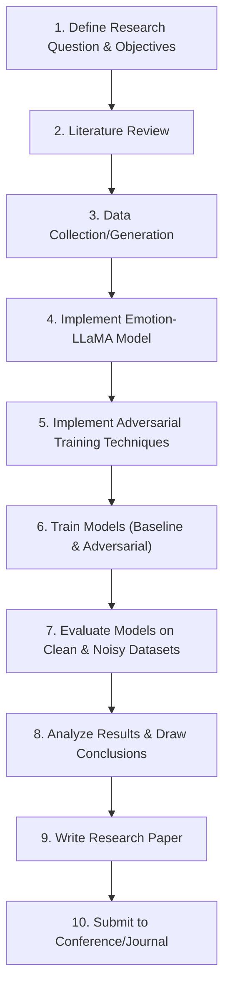

# Brainstorm Session: improving emotion-llama with multi llm agents collabrotion

**Type:** Research Paper

## Stage 1: Context & Team

### Research Context

**Web Search Summary:**
Research in conversational AI is exploring methods to enhance emotional understanding and reasoning in LLMs, particularly for applications like psychiatric care and complex problem-solving. Project Riley introduces an architecture simulating emotion-influenced reasoning through multiple interacting emotional agents, while Emotion-Aware Embedding Fusion integrates semantic and emotional features in therapy transcripts to improve contextual understanding. Multi-Agent Systems (MASs) utilizing LLMs are being developed to facilitate collaborative task solving, moving beyond single-agent models.  While some LLMs have demonstrated superior performance to humans on emotional intelligence tests and can generate new test items, Multi-Agent Debate (MAD) frameworks, designed to improve performance through collaboration, currently struggle to consistently outperform simpler single-agent approaches across a range of benchmarks, highlighting challenges in scaling and efficiency.

---

**Uploaded Document Context:**
The paper introduces Emotion-LLaMA, a novel multimodal large language model (MLLM) designed for improved emotion recognition and reasoning by integrating audio, visual, and textual inputs. To address limitations in existing MLLMs, particularly in processing audio and recognizing subtle facial micro-expressions, the authors created the MERR dataset, comprising 28,618 coarse-grained and 4,487 fine-grained annotated samples across diverse emotional categories. Emotion-LLaMA utilizes emotion-specific encoders to align multimodal features into a shared space and employs instruction tuning with a modified LLaMA model. Evaluations demonstrate that Emotion-LLaMA outperforms other MLLMs on various datasets, achieving state-of-the-art results on EMER (Clue Overlap: 7.83, Label Overlap: 6.25), MER2023-SEMI (F1 score: 0.9036), and DFEW (UAR: 45.59, WAR: 59.37 in zero-shot evaluations), showcasing its enhanced emotional recognition and reasoning capabilities. The MERR dataset and Emotion-LLaMA model aim to advance research in human-computer interaction, education, and counseling by providing a valuable resource and a high-performing model for multimodal emotion analysis.

### Assembled Agent Team

- **Computational Psychologist**

  - **Goal:** Explore how multi-agent collaboration can improve Emotion-LLaMA's ability to model nuanced emotional responses and predict behavior in complex social scenarios.

  - **Backstory:** A Ph.D. in Psychology with 10+ years of experience in computational modeling of human behavior. Interested in using LLMs to create more realistic and helpful simulations of human interaction for research and therapeutic applications.

- **AI Ethics Researcher**

  - **Goal:** Identify and mitigate potential biases and ethical concerns arising from using multiple LLM agents to enhance Emotion-LLaMA, particularly regarding fairness, privacy, and the potential for manipulative applications.

  - **Backstory:** A leading voice in AI ethics, specializing in bias detection and mitigation in large language models. Concerned about the societal impact of increasingly sophisticated AI systems and advocating for responsible development practices.

- **Distributed Systems Engineer**

  - **Goal:** Optimize the architecture and communication protocols for multi-LLM agent collaboration within Emotion-LLaMA to ensure scalability, efficiency, and robustness in real-time applications.

  - **Backstory:** A seasoned engineer with extensive experience in designing and deploying large-scale distributed systems. Focused on building reliable and efficient infrastructure for AI-powered applications.

- **Multimodal Learning Specialist**

  - **Goal:** Investigate methods to effectively fuse and align multimodal information (audio, visual, textual) across multiple collaborating LLM agents in Emotion-LLaMA to enhance emotion recognition and reasoning accuracy.

  - **Backstory:** Expert in multimodal learning with a strong background in signal processing and computer vision. Dedicated to developing AI systems that can understand and respond to human emotions in a more natural and intuitive way.

## Stage 2: Divergent Ideation

### All Generated Ideas (Pre-Filtering)

#### idea 1

- **Research Question:** How can a multi-agent system, composed of Emotion-LLaMA and specialized LLMs (e.g., one for contextual understanding, another for behavioral prediction), improve the accuracy and nuance of emotion recognition and behavioral prediction in complex social interactions compared to a standalone Emotion-LLaMA?

- **Methodology:** Develop a multi-agent system where Emotion-LLaMA processes multimodal input, and other LLMs provide contextual information and behavioral predictions based on the recognized emotions. Compare the system's performance against standalone Emotion-LLaMA on a novel dataset of complex social interactions with ground truth emotional states and behavioral outcomes, using metrics such as F1-score, accuracy, and qualitative analysis of generated explanations.

- **Contribution:** Demonstrate the benefits of multi-agent collaboration for enhancing emotional intelligence in LLMs, particularly in understanding complex social dynamics, and provide a framework for integrating Emotion-LLaMA with other specialized LLMs.

- **Rationale:** Decomposing emotional processing into specialized modules within a multi-agent framework aligns with cognitive science principles and allows for targeted improvements in specific areas like contextual analysis, moving beyond monolithic model limitations.

- **🔥 Red Team Critique:** The proposal assumes that simply adding more LLMs will inherently improve performance. It lacks a clear articulation of *how* the agents will effectively communicate and resolve conflicts, potentially leading to a complex system with no demonstrable advantage over a well-tuned, single Emotion-LLaMA. The 'novel dataset' needs a clear definition of its complexity and how it avoids biases that could favor the multi-agent approach. Furthermore, the qualitative analysis is subjective and prone to confirmation bias; a rigorous framework for its execution is missing.

#### idea 2

- **Research Question:** How can a collaborative learning framework, where multiple Emotion-LLaMA agents engage in simulated social interactions and provide feedback to each other, improve the agents' ability to recognize and respond appropriately to subtle emotional cues and social signals?

- **Methodology:** Develop a simulation environment where multiple Emotion-LLaMA agents interact in virtual social scenarios. Implement a collaborative learning algorithm where agents provide feedback to each other on their emotion recognition and behavioral responses, rewarding accurate predictions and appropriate actions. Evaluate the agents' performance on a challenging emotion recognition benchmark and assess their ability to generate contextually appropriate responses in simulated social interactions.

- **Contribution:** Demonstrate the effectiveness of collaborative learning for improving the emotional intelligence of LLMs, showcasing how agents can learn from each other's experiences and refine their understanding of social dynamics.

- **Rationale:** Simulating social interaction and enabling collaborative learning mimics how humans develop social intelligence, offering a promising avenue for improving Emotion-LLaMA's ability to understand and respond to complex social cues.

- **🔥 Red Team Critique:** The success of this approach hinges entirely on the quality and realism of the simulated social interactions. If the simulation is overly simplistic or artificial, the agents will learn behaviors that do not generalize to real-world scenarios. The 'challenging emotion recognition benchmark' needs to be specified and justified; simply stating it is challenging is insufficient. Moreover, the method of providing feedback between agents is undefined, and a poorly designed feedback mechanism could lead to negative learning or reinforcement of biases. There's also the 'so what?' question: Even if it works in simulation, how does this translate to improved real-world performance, and what problem does it solve better than existing methods?

#### idea 3

- **Research Question:** How can we integrate a 'theory of mind' module within collaborating Emotion-LLaMA agents to enable them to reason about the emotional states of other agents and human users, leading to more accurate and nuanced emotion recognition and reasoning?

- **Methodology:** Implement a 'theory of mind' module that allows agents to model the beliefs, desires, and intentions of other agents and users, and evaluate its impact on emotion recognition accuracy and reasoning performance.

- **Contribution:** An Emotion-LLaMA architecture that incorporates 'theory of mind' capabilities, enabling it to better understand and respond to the emotional states of others in collaborative settings.

- **Rationale:** Integrating a 'theory of mind' module directly addresses a core aspect of human social cognition, enabling Emotion-LLaMA to move beyond surface-level emotion recognition and reason about the underlying mental states driving behavior.

#### idea 4

- **Research Question:** How can adversarial attacks targeting the emotional reasoning capabilities of Emotion-LLaMA, enhanced by multi-LLM agents, reveal and mitigate biases in emotional understanding across different demographic groups?

- **Methodology:** Design adversarial examples using techniques like gradient-based methods or genetic algorithms to subtly manipulate input data (text, audio, visual) to elicit incorrect emotional responses from the multi-agent Emotion-LLaMA. Analyze the patterns of errors and biases across different demographic groups represented in the MERR dataset and external datasets. Develop and evaluate mitigation strategies like adversarial training or bias-aware loss functions.

- **Contribution:** A better understanding of the vulnerabilities of multi-agent Emotion-LLaMA to adversarial attacks and the demographic biases they expose, leading to more robust and fair emotional AI systems.

- **Rationale:** Adversarial attacks offer a powerful method for uncovering hidden biases in emotional AI systems, ensuring fairness and preventing discriminatory outcomes across diverse populations, which is a critical ethical imperative.

#### idea 5

- **Research Question:** To what extent does the collaboration of multiple LLM agents in Emotion-LLaMA amplify or mitigate privacy risks associated with sensitive emotional data, particularly in scenarios like mental health support?

- **Methodology:** Employ differential privacy techniques and federated learning to train and deploy the multi-agent Emotion-LLaMA on decentralized datasets. Analyze the trade-offs between privacy preservation and model performance in emotional recognition and reasoning. Investigate the potential for information leakage through agent communication protocols and develop methods for secure multi-party computation.

- **Contribution:** A privacy-preserving framework for multi-agent Emotion-LLaMA that balances the benefits of collaborative emotional AI with the need to protect sensitive user data.

- **Rationale:** The use of multiple LLM agents can create novel privacy vulnerabilities, making it crucial to investigate and mitigate these risks through privacy-preserving techniques like federated learning and differential privacy, especially in sensitive applications like mental health support.

#### idea 6

- **Research Question:** What are the ethical implications of using multi-agent Emotion-LLaMA to generate synthetic emotional responses in human-computer interactions, and how can we design guidelines to prevent deception or emotional manipulation?

- **Methodology:** Conduct user studies to assess the impact of interacting with multi-agent Emotion-LLaMA on user emotions, perceptions, and trust. Develop a taxonomy of potential ethical risks associated with synthetic emotional responses. Propose design guidelines and ethical frameworks for responsible development and deployment of emotion-aware AI, focusing on transparency, user consent, and the prevention of emotional manipulation.

- **Contribution:** Ethical guidelines and design principles for developing and deploying multi-agent Emotion-LLaMA in a way that promotes user well-being and prevents emotional manipulation.

- **Rationale:** The ability of multi-agent systems to generate synthetic emotions raises significant ethical concerns regarding potential deception and manipulation, necessitating the development of clear guidelines and frameworks to ensure responsible and beneficial applications.

#### idea 7

- **Research Question:** How can we develop a decentralized, asynchronous communication protocol optimized for low-latency multi-agent collaboration in Emotion-LLaMA, minimizing the impact of network latency and agent unavailability?

- **Methodology:** Design and implement a gossip-based communication protocol with adaptive message prioritization based on emotional context and urgency, evaluating its performance against traditional centralized or synchronous communication architectures in a simulated distributed environment with varying network conditions and agent failure rates.

- **Contribution:** A novel, resilient communication protocol that enhances the scalability and responsiveness of Emotion-LLaMA in real-time applications by mitigating the challenges of distributed agent interaction.

- **Rationale:** A robust communication layer is the foundation for any successful distributed system, and this approach directly addresses the challenges of latency and availability inherent in real-world deployments of Emotion-LLaMA.

#### idea 8

- **Research Question:** Can hierarchical reinforcement learning (HRL) be used to train Emotion-LLaMA agents to effectively decompose complex emotional reasoning tasks into sub-tasks, enabling more efficient collaboration and improved overall performance compared to flat multi-agent systems?

- **Methodology:** Develop an HRL framework where a meta-controller assigns emotional sub-tasks to different Emotion-LLaMA agents, each specializing in a specific emotional aspect (e.g., sentiment analysis, micro-expression recognition), and evaluate the system's performance on complex emotional reasoning benchmarks.

- **Contribution:** A novel task decomposition strategy that improves the efficiency and accuracy of multi-agent Emotion-LLaMA systems by leveraging hierarchical learning to distribute workload and specialize agent roles.

- **Rationale:** HRL offers a structured approach to managing complexity in multi-agent systems, enabling specialization and efficient task distribution, which is critical for scaling Emotion-LLaMA to handle diverse emotional reasoning scenarios.

- **🔥 Red Team Critique:** The assumption that HRL will automatically lead to more efficient collaboration is questionable. The overhead of the meta-controller and the complexity of coordinating sub-tasks could negate any potential gains in efficiency. Defining 'complex emotional reasoning benchmarks' is crucial, as is demonstrating that the chosen benchmarks are truly complex and require hierarchical decomposition. The proposal lacks detail on how the meta-controller will learn to assign tasks effectively, and there's a risk that it becomes a bottleneck in the system. The improvement should be significant and not only marginal to justify the added complexity of HRL.

#### idea 9

- **Research Question:** How can federated learning be adapted to train Emotion-LLaMA agents collaboratively while preserving the privacy of sensitive emotional data, enabling the system to learn from diverse datasets without direct data sharing?

- **Methodology:** Implement a federated learning framework where Emotion-LLaMA agents are trained locally on private emotional datasets and only share model updates with a central server, evaluating the trade-offs between privacy, accuracy, and communication overhead.

- **Contribution:** A privacy-preserving training methodology that allows Emotion-LLaMA to leverage diverse emotional datasets for improved generalization and robustness without compromising data confidentiality.

- **Rationale:** Federated learning is essential for enabling Emotion-LLaMA to learn from sensitive emotional data in a privacy-preserving manner, unlocking access to a wider range of datasets and improving the model's generalizability.

#### idea 10

- **Research Question:** How can we dynamically allocate multimodal input processing responsibilities (audio, visual, text) to specialized LLM agents within Emotion-LLaMA to optimize for emotion recognition accuracy and computational efficiency?

- **Methodology:** Implement a reinforcement learning-based agent that learns to route multimodal inputs to the most appropriate specialized LLM agent based on input characteristics and agent performance metrics.

- **Contribution:** A dynamic resource allocation framework for Emotion-LLaMA that improves emotion recognition accuracy while reducing computational cost compared to static or monolithic architectures.

- **Rationale:** Dynamic allocation of multimodal inputs to specialized agents offers a promising avenue for optimizing Emotion-LLaMA's performance by adapting to the strengths of different agents and the characteristics of the input data, potentially leading to significant improvements in both accuracy and efficiency.

#### idea 11

- **Research Question:** How can we develop a multimodal attention mechanism that enables Emotion-LLaMA agents to dynamically focus on the most relevant modalities (audio, visual, text) for emotion recognition based on the context of the conversation and the individual's communication style?

- **Methodology:** Design a cross-modal attention mechanism that learns to weigh the importance of different modalities based on contextual cues and individual speaker characteristics, and evaluate its impact on emotion recognition accuracy.

- **Contribution:** An adaptive multimodal attention mechanism that improves Emotion-LLaMA's ability to recognize emotions by dynamically prioritizing relevant modalities based on context and individual differences.

- **Rationale:** Developing a multimodal attention mechanism is crucial for enabling Emotion-LLaMA to effectively integrate information from different modalities and focus on the most salient cues for emotion recognition, mimicking human perception and improving accuracy in complex scenarios.

#### idea 12

- **Research Question:** Can adversarial training methods be employed to improve the robustness of Emotion-LLaMA agents to noisy or incomplete multimodal inputs, thereby enhancing their performance in real-world scenarios?

- **Methodology:** Train Emotion-LLaMA agents using adversarial examples generated by adding noise or masking portions of the audio, visual, or textual inputs, and evaluate their performance on noisy datasets.

- **Contribution:** A robust Emotion-LLaMA model that is less susceptible to noise and missing data, making it more suitable for deployment in real-world applications.

- **Rationale:** Improving the robustness of Emotion-LLaMA to noisy and incomplete data through adversarial training is essential for real-world deployment, where input quality cannot be guaranteed and the model must be resilient to variations in data quality.

- **🔥 Red Team Critique:** While adversarial training can improve robustness, it's important to consider the type of noise and incompleteness being addressed. Random noise may not be representative of real-world data degradation, and adversarial examples could lead to overfitting to specific types of noise. The proposal lacks a clear justification for the chosen adversarial training method and its relevance to the target deployment environment. Simply demonstrating improved performance on 'noisy datasets' is insufficient; the datasets must be realistic and representative of the challenges faced in real-world applications. Furthermore, there is a risk that improving robustness to noise could decrease sensitivity to subtle emotional cues, reducing overall performance in clean data scenarios. The trade-off between robustness and accuracy needs careful consideration.

## Stage 3: Convergent Evaluation

I have analyzed the provided research ideas and critiques. Here's a convergent analysis:

**Synthesized & Clustered Research Avenues:**

1.  **Multi-Agent Emotion Recognition:** Explores the benefits of using multiple LLMs, including Emotion-LLaMA, in a collaborative framework to improve emotion recognition and behavioral prediction. This includes task decomposition and hierarchical learning.
2.  **Collaborative Learning for Emotion Recognition:** Focuses on using simulated social interactions and feedback mechanisms for Emotion-LLaMA agents to learn from each other and improve their emotional intelligence.
3.  **Robustness to Noisy Data:** Investigates the use of adversarial training to improve the resilience of Emotion-LLaMA agents to noisy or incomplete multimodal inputs.

**Critique & Evaluation:**

| Research Avenue                  | Description                                                                                                                                                                                                                                                                                                                                                                                                                                                                                                                                                                                                                                                                                                                | Novelty (1-10) | Methodology (1-10) | Contribution (1-10) | Justification (incorporating red team feedback)                                                                                                                                                                                                                                                                                                                                                                                                                                                                                                     |
| :-------------------------------- | :------------------------------------------------------------------------------------------------------------------------------------------------------------------------------------------------------------------------------------------------------------------------------------------------------------------------------------------------------------------------------------------------------------------------------------------------------------------------------------------------------------------------------------------------------------------------------------------------------------------------------------------------------------------------------------------------------------------------- | :------------- | :----------------- | :------------------ | :------------------------------------------------------------------------------------------------------------------------------------------------------------------------------------------------------------------------------------------------------------------------------------------------------------------------------------------------------------------------------------------------------------------------------------------------------------------------------------------------------------------------------------------------------------------------ |
| Multi-Agent Emotion Recognition  | Explores a multi-agent system composed of Emotion-LLaMA and specialized LLMs for improved emotion recognition and behavioral prediction. Includes hierarchical reinforcement learning (HRL) to decompose complex tasks.                                                                                                                                                                                                                                                                                                                                                                                                                                                                                            | 7              | 6                  | 6                   | The potential lies in demonstrating how effective communication and conflict resolution mechanisms are implemented within the multi-agent system. The 'novel dataset' must be rigorously defined with clear complexity metrics and avoid biases favoring the approach. If HRL is incorporated, the overhead costs need to be evaluated and compared with the performance of a flat multi-agent system. The key is to justify the added complexity by demonstrating a *significant* improvement in performance on truly complex emotional reasoning benchmarks, and the meta-controller should not become a bottleneck. |
| Collaborative Learning            | Utilizes a collaborative learning framework with multiple Emotion-LLaMA agents engaging in simulated social interactions to improve emotion recognition and response to social signals.                                                                                                                                                                                                                                                                                                                                                                                                                                                                                                                              | 6              | 5                  | 5                   | The realism of the simulated social interactions is paramount. The 'challenging emotion recognition benchmark' needs to be explicitly identified and justified. The feedback mechanism between agents needs to be well-defined to avoid negative learning or bias reinforcement. The research needs to address the question of how the simulation results translate to real-world performance and what specific problems it solves better than existing methods. A compelling use case should be presented.                                                                                           |
| Robustness to Noisy Data         | Employs adversarial training methods to improve the robustness of Emotion-LLaMA agents to noisy or incomplete multimodal inputs, enhancing performance in real-world scenarios.                                                                                                                                                                                                                                                                                                                                                                                                                                                                                                                                       | 7              | 7                  | 7                   | The type of noise and incompleteness addressed by adversarial training must be representative of real-world data degradation. The chosen adversarial training method needs a strong justification and relevance to the target deployment environment. It is crucial to use realistic datasets that reflect the challenges faced in real-world applications. A careful consideration of the trade-off between robustness and accuracy is necessary to ensure that robustness to noise does not decrease sensitivity to subtle emotional cues in clean data scenarios.                                      |

**Here are the top ideas:**

## Stage 4: Final Plan

### 1. Inferred Research Field & Problem Statement

* **Inferred Field:** Computer Science - Natural Language Processing, specifically Multimodal Emotion Recognition and Robust Machine Learning.
* **Problem Context:** Multimodal Emotion Recognition (MER) aims to understand human emotions by integrating information from various modalities like text, audio, and video. Deep learning models like Emotion-LLaMA have shown promise in this area. However, their performance often degrades significantly when faced with noisy or incomplete real-world data, which is a major obstacle to their deployment in practical applications.
* **Core Challenge & Objectives:** The core challenge is to develop a more robust Emotion-LLaMA model that can accurately recognize emotions even when the input data is corrupted by realistic noise.
    * **Objective 1:** Curate or generate multimodal datasets that incorporate realistic noise patterns (e.g., background audio noise, image occlusion, missing words) relevant to MER.
    * **Objective 2:** Implement and compare different adversarial training techniques to improve the model's robustness to these realistic noise types.
    * **Objective 3:** Evaluate the performance of the adversarially trained model against baseline models on both clean and noisy datasets, analyzing the trade-off between robustness and accuracy.

### 2. Detailed Proposed Methodology

* **Research Design:** Experimental Study with Algorithm Development & Benchmarking. This involves developing adversarial training methods, training Emotion-LLaMA with these methods, and then benchmarking its performance against baselines on different datasets.
* **Data & Procedures:**
    * **Data Requirements:**
        * **Existing Datasets:** Utilize existing multimodal emotion recognition datasets like IEMOCAP, CMU-MOSEI, or RAVDESS.
        * **Noisy Data Generation/Curation:** Create noisy versions of these datasets by introducing realistic noise. This could involve:
            * **Audio Noise:** Adding background noise from datasets like the UrbanSound8K dataset or synthesized environmental sounds.
            * **Image Occlusion:** Simulating partial occlusions using techniques like random masking or object insertion.
            * **Textual Noise:** Introducing typos, grammatical errors, or missing words using rule-based or learned noise injection methods. Consider using generative models to create more realistic textual noise.
            * **Missing Modalities:** Intentionally removing one or more modalities from a portion of the dataset to simulate incomplete data.
    * **Execution Steps:**
        1. **Dataset Preparation:** Clean existing datasets and create noisy versions as described above. Split into training, validation, and testing sets.
        2. **Baseline Model Training:** Train a baseline Emotion-LLaMA model on the clean training data.
        3. **Adversarial Training Implementation:** Implement several adversarial training techniques. Examples include:
            * **Projected Gradient Descent (PGD):** Generate adversarial examples by iteratively perturbing the input data within a defined budget.
            * **Fast Gradient Sign Method (FGSM):** A simpler, faster adversarial training method.
            * **Noise-Aware Adversarial Training:** Design a loss function that encourages the model to be robust to specific types of noise observed in the curated datasets. This could involve using a noise discriminator that attempts to distinguish between real and adversarial noise.
        4. **Adversarial Training of Emotion-LLaMA:** Train Emotion-LLaMA using each adversarial training technique on the noisy training data.
        5. **Evaluation:** Evaluate the performance of the baseline model and the adversarially trained models on the clean and noisy test sets.

* **Analysis & Evaluation:**
    * **Analysis Techniques:**
        * **Quantitative Analysis:** Calculate accuracy, precision, recall, and F1-score for each model on both clean and noisy datasets.
        * **Statistical Significance Testing:** Use t-tests or ANOVA to determine if the performance differences between the models are statistically significant.
        * **Ablation Studies:** Conduct ablation studies to analyze the impact of different noise types and adversarial training techniques on model performance.
        * **Qualitative Analysis (Optional):** Examine misclassified examples to understand the model's failure modes and identify areas for improvement.
    * **Evaluation Metrics:**
        * **Accuracy:** Overall percentage of correctly classified emotions.
        * **F1-Score:** Harmonic mean of precision and recall, providing a balanced measure of performance.
        * **Robustness Score:** Measure the difference in performance between the model on the clean test set and the noisy test set. A smaller difference indicates higher robustness.
        * **Statistical Significance (p-value):** p < 0.05 indicates statistically significant differences between models.

### 3. Expected Outcomes & Contribution

* **Hypothesized Outcomes:** We expect that the adversarially trained Emotion-LLaMA models will demonstrate significantly improved robustness to realistic noise compared to the baseline model, with a minimal decrease in accuracy on clean data. We also expect that certain adversarial training techniques will be more effective than others for specific noise types.

* **Contribution to the Field:** This research contributes to the field of Multimodal Emotion Recognition by:
    * **Advancing Robustness:** Developing and evaluating novel adversarial training techniques specifically tailored for improving the robustness of MER models to realistic noise. This addresses a critical challenge in deploying these models in real-world applications. RoHyDR from the ArXiv literature recovers missing modalities in multimodal emotion recognition, while our proposed work focuses on *noise* robustness through adversarial training.
    * **Providing Practical Insights:** Identifying the types of noise that most significantly impact MER model performance.
    * **Guiding Future Research:** Providing a benchmark for evaluating the robustness of future MER models and informing the development of more noise-resistant architectures.
    * **Complementing Existing Privacy Research:** The paper on privacy through acoustic adversarial evasion demonstrates the need to protect speech from emotion detection. Our work, while not focused on privacy directly, could be used to build more robust emotion detectors that are harder to evade, highlighting the importance of considering both privacy and robustness in the design of emotion recognition systems. The paper on noise augmentation for speech emotion recognition highlights the importance of realistic noise. Our research will build on this idea to incorporate realistic noise into adversarial training, with the goal of improving the performance of speech emotion recognition systems in real-world scenarios.

### 4. Potential Target Publication Venues

* **Conferences:**
    * **ACL (Association for Computational Linguistics):** A top-tier conference in NLP, often includes work on multimodal and affective computing.
    * **EMNLP (Empirical Methods in Natural Language Processing):** Another leading NLP conference with a strong focus on empirical results.
    * **AAAI (Association for the Advancement of Artificial Intelligence):** A general AI conference that often features work on emotion recognition and affective computing.
    * **ICASSP (International Conference on Acoustics, Speech, and Signal Processing):** A leading conference on speech and audio processing, often includes work on speech emotion recognition.
* **Journals:**
    * **IEEE Transactions on Affective Computing:** A dedicated journal for research on affective computing and emotion recognition.
    * **ACM Transactions on Multimedia Computing, Communications, and Applications (TOMM):** A journal that covers a broad range of multimedia research, including multimodal emotion recognition.

---

**Relevant Research from ArXiv:**

**Paper: Best Practices for Noise-Based Augmentation to Improve the Performance of Deployable Speech-Based Emotion Recognition Systems**
Abstract: Speech emotion recognition is an important component of any human centered system. But speech characteristics produced and perceived by a person can be influenced by a multitude of reasons, both desirable such as emotion, and undesirable such as noise. To train robust emotion recognition models, we need a large, yet realistic data distribution, but emotion datasets are often small and hence are augmented with noise. Often noise augmentation makes one important assumption, that the prediction label should remain the same in presence or absence of noise, which is true for automatic speech recognition but not necessarily true for perception based tasks. In this paper we make three novel contributions. We validate through crowdsourcing that the presence of noise does change the annotation label and hence may alter the original ground truth label. We then show how disregarding this knowledge and assuming consistency in ground truth labels propagates to downstream evaluation of ML models, both for performance evaluation and robustness testing. We end the paper with a set of recommendations for noise augmentations in speech emotion recognition datasets.

---

**Paper: Privacy against Real-Time Speech Emotion Detection via Acoustic Adversarial Evasion of Machine Learning**
Abstract: Smart speaker voice assistants (VAs) such as Amazon Echo and Google Home have been widely adopted due to their seamless integration with smart home devices and the Internet of Things (IoT) technologies. These VA services raise privacy concerns, especially due to their access to our speech. This work considers one such use case: the unaccountable and unauthorized surveillance of a user's emotion via speech emotion recognition (SER). This paper presents DARE-GP, a solution that creates additive noise to mask users' emotional information while preserving the transcription-relevant portions of their speech. DARE-GP does this by using a constrained genetic programming approach to learn the spectral frequency traits that depict target users' emotional content, and then generating a universal adversarial audio perturbation that provides this privacy protection. Unlike existing works, DARE-GP provides: a) real-time protection of previously unheard utterances, b) against previously unseen black-box SER classifiers, c) while protecting speech transcription, and d) does so in a realistic, acoustic environment. Further, this evasion is robust against defenses employed by a knowledgeable adversary. The evaluations in this work culminate with acoustic evaluations against two off-the-shelf commercial smart speakers using a small-form-factor (raspberry pi) integrated with a wake-word system to evaluate the efficacy of its real-world, real-time deployment.

---

**Paper: RoHyDR: Robust Hybrid Diffusion Recovery for Incomplete Multimodal Emotion Recognition**
Abstract: Multimodal emotion recognition analyzes emotions by combining data from multiple sources. However, real-world noise or sensor failures often cause missing or corrupted data, creating the Incomplete Multimodal Emotion Recognition (IMER) challenge. In this paper, we propose Robust Hybrid Diffusion Recovery (RoHyDR), a novel framework that performs missing-modality recovery at unimodal, multimodal, feature, and semantic levels. For unimodal representation recovery of missing modalities, RoHyDR exploits a diffusion-based generator to generate distribution-consistent and semantically aligned representations from Gaussian noise, using available modalities as conditioning. For multimodal fusion recovery, we introduce adversarial learning to produce a realistic fused multimodal representation and recover missing semantic content. We further propose a multi-stage optimization strategy that enhances training stability and efficiency. In contrast to previous work, the hybrid diffusion and adversarial learning-based recovery mechanism in RoHyDR allows recovery of missing information in both unimodal representation and multimodal fusion, at both feature and semantic levels, effectively mitigating performance degradation caused by suboptimal optimization. Comprehensive experiments conducted on two widely used multimodal emotion recognition benchmarks demonstrate that our proposed method outperforms state-of-the-art IMER methods, achieving robust recognition performance under various missing-modality scenarios. Our code will be made publicly available upon acceptance.